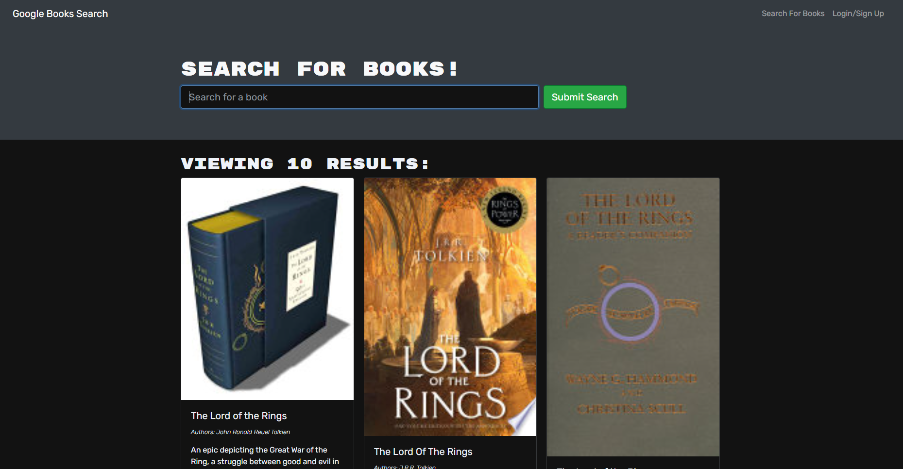

# Google Book Search

## Description
View the deployed application: https://book-search-engine-tikomyster.herokuapp.com/

This project is a Google Books search engine built with GraphQL API. The app was built using the MERN stack, with a React front end, MongoDB database, and Node.js/Express.js server and API. 

## Usage

1. User can visit the website and search for books. Enter the books name and click the submit search button, then users can see search results.
2. User can also save the books to localstorage by clicking the save this book button. But they need to login first.
3. User can view the saved books in seeyourbook page. They can also remove the saved books.

## Screenshots

 Contact me: tikomyster20@gmail.com
